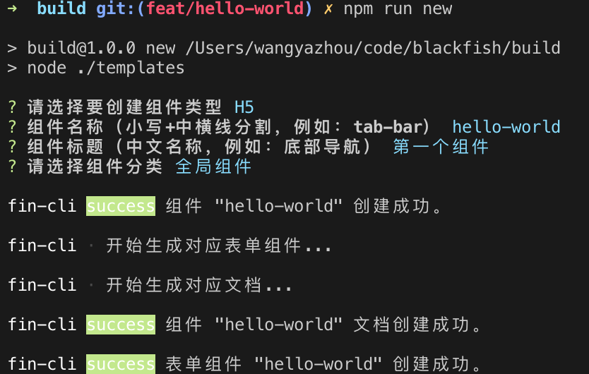
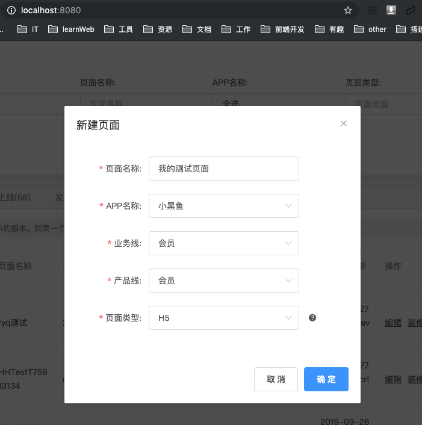
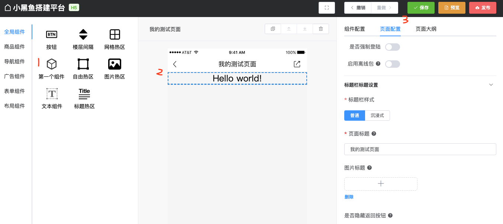
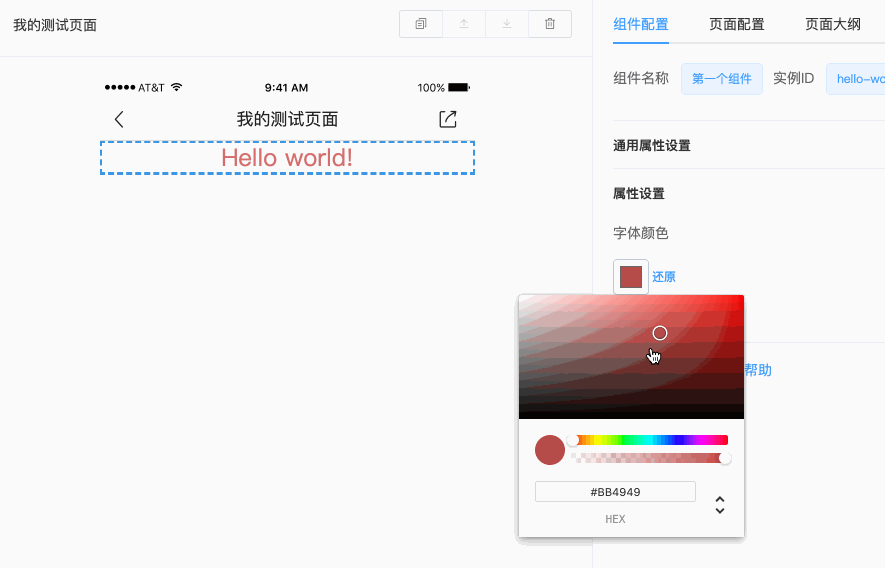
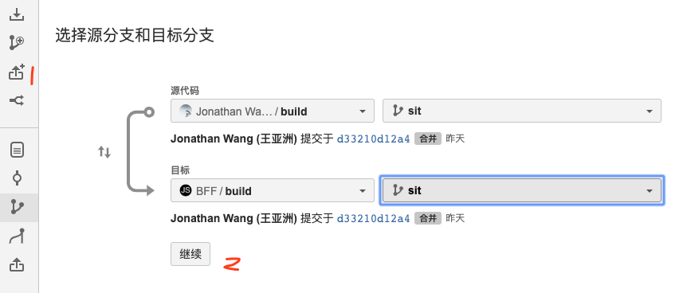

# 快速上手

项目本地运行起来后，我们便可以进行组件的开发了。

下面介绍一个简单的组件HelloWorld的开发流程。

这个组件主要功能：
- 在界面居中展示文字“Hello World”
- 可以定制字体颜色

## 新增组件

养成良好习惯，当我们开发新功能时，先从master分支切一个功能分支。
```bash
$ git:(master) git checkout -b feat/hello-world
```
然后项目根目录执行，下面命令
```bash
$ git:(feat/hello-world) npm run new
```
然后根据提示填入或选择相应的值



从日志上可以看出脚手架帮我们生成3部分内容

- 组件的基本代码，用于编写组件的逻辑
- 组件的表单代码，通过表单我们可以控制组件属性的设置和修改
- 组件的文档，主要介绍组件的使用方法

::: tip
如果新增weex组件，在组件类型下面选择weex即可，其他操作一致
:::

## 代码编写
在目录`packages/components/packages/hello-world`，可以看到生成的组件基本文件信息。

四个文件：
- config.js (组件的属性信息)
- HelloWorld.vue (组件的代码文件)
- icon.png (组件在搭建客户端中对应的小图标)
- index.js (组件的入口文件)

打开`HelloWorld.vue`，我们就可以按照正常写vue组件一样去写开发逻辑了。

因为要可以支持修改颜色，定义一个color属性

```js
export const props = {
  color: String
}
```

编写页面
```html
<template>
  <div class="bld-hello-world">
    <h1 :style="{ color }">Hello world!</h1>
  </div>
</template>
```
写一下组件的基本样式
```less
<style lang="less" scoped>
@moudle: bld-hello-world;
.@{moudle} {
  h1 {
    font-size: 24*2rp;
    color: #000;
    line-height: normal;
    text-align: center;
  }
}
</style>
```
::: tip
`rp`是相对750的弹性大小单位，我们ui图一般基于375，所以是参照标注尺寸乘以2即可
:::

## 效果预览
组件写完可以在搭建系统里面进行预览调试。

新增一个自己的调试页面


点击装修进入编辑器界面，然后找到我们的正在开发的组件，添加到编辑器预览区中。点击保存，避免页面刷新后再次添加。



至此，我们完成了组件的开发，在编辑器可以看到效果。并且我们组件代码做修改，可以看到实时变化。

## 表单组件
上面我们组件定义了一个`color`属性，但目前还不支持在编辑器中实时修改。需要接下来写一个简单的表单代码去控制其属性的修改。

脚手架之前已帮我们生成好了对应的文件。
打开`packages/build-common/forms/hello-world/HelloWorldForm.vue`

添加下面代码
```html
<template>
  <el-form label-position="top" size="small" :model="context" :key="context.id">
    <el-collapse-item title="属性设置">
      <el-form-item label="字体颜色">
        <color-picker v-model="context.props.color" />
      </el-form-item>
    </el-collapse-item>
  </el-form>
</template>
```
代码很好理解，通过`context`关键字可以拿到组件的属性，对color属性做修改。完成后看下下面效果：



## 文档

为了别人更好的使用我们的组件，还应写一下组件的文档。

打开`packages/build-docs/components/hello-world/README.md`

写一下组件的介绍和使用方法。

## 选一个漂亮的图标

可以在[iconfont.cn](https://www.iconfont.cn/) 给自己组件挑选一个漂亮的小图标，替换掉脚手架默认生成的。

## 发布

### sit 提测
```bash
$ git:(feat/hello-world) git add .
$ git:(feat/hello-world) git commit -m '[add] hello world component'
$ git:(feat/hello-world) git checkout sit
$ git:(sit) git pull
$ git:(sit) git merge feat/hello-world
$ git:(sit) git push
```

### pull request
去主仓库提pr，进行合并



如果前期开发建议将pr合并请求发给`@JonathanWang(王亚洲)` `@JieLi01 (李杰)` `@MonetYang(杨怀江)`
进行code review 后再执行合并。

weex 组件发给 `@JinquanZhang(章金泉)` 进行 code review。

### 上线
测试通过后，将 feat/hello-world 分支合并到 master，重复执行上面步骤即可。

至此，我们完成搭建一个组件开发到上线的整个流程。
