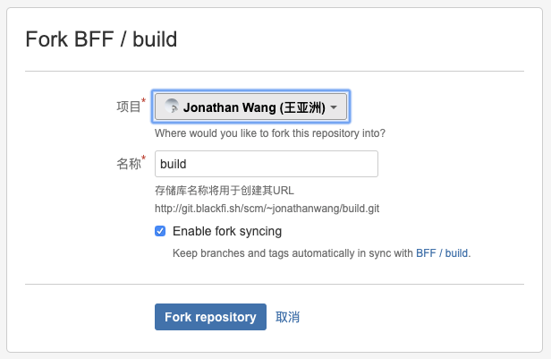

# 开发环境

## 环境依赖

- node / v8.14.0+
- npm / 6.8.0+
- yarn / 1.15.2+
- [小黑鱼NPM](http://wiki.blackfi.sh/pages/viewpage.action?pageId=9195584)

## 项目地址
[git地址](http://git.blackfi.sh/scm/bff/build.git)

## Fork到自己私有仓库



然后从自己fork后的仓库地址，clone到本地运行

## 项目运行
```bash
$ yarn
$ npm run bootstrap
$ npm run serve
```

稍等片刻，项目会帮我们运行起来4个开发服务
- 搭建系统server
- 搭建系统客户端
- 搭建文档系统服务
- weex模拟器服务

对于我们组件开发，只需要关注客户端即可，运行结束访问`http://localhost:8080/`，即可看到搭建在本地运行界面。
