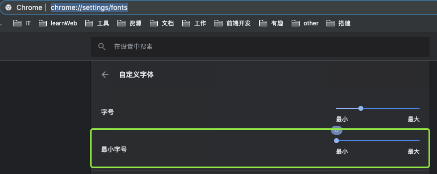

# 准备工作

## Base 权限申请

Base中申请以下目录权限

基础能力平台 / 搭建系统 / 页面列表

## 浏览器设置

为了有更好的操作体验建议使用[chrome浏览器](https://www.baidu.com/s?wd=chrome)

chrome浏览器有最小字体限制， 一些小字体效果无法正确展示。通过以下设置取消即可。

1. 浏览器输入：chrome://settings/fonts 回车
2. 最小字体选项，滑块拖到最小

